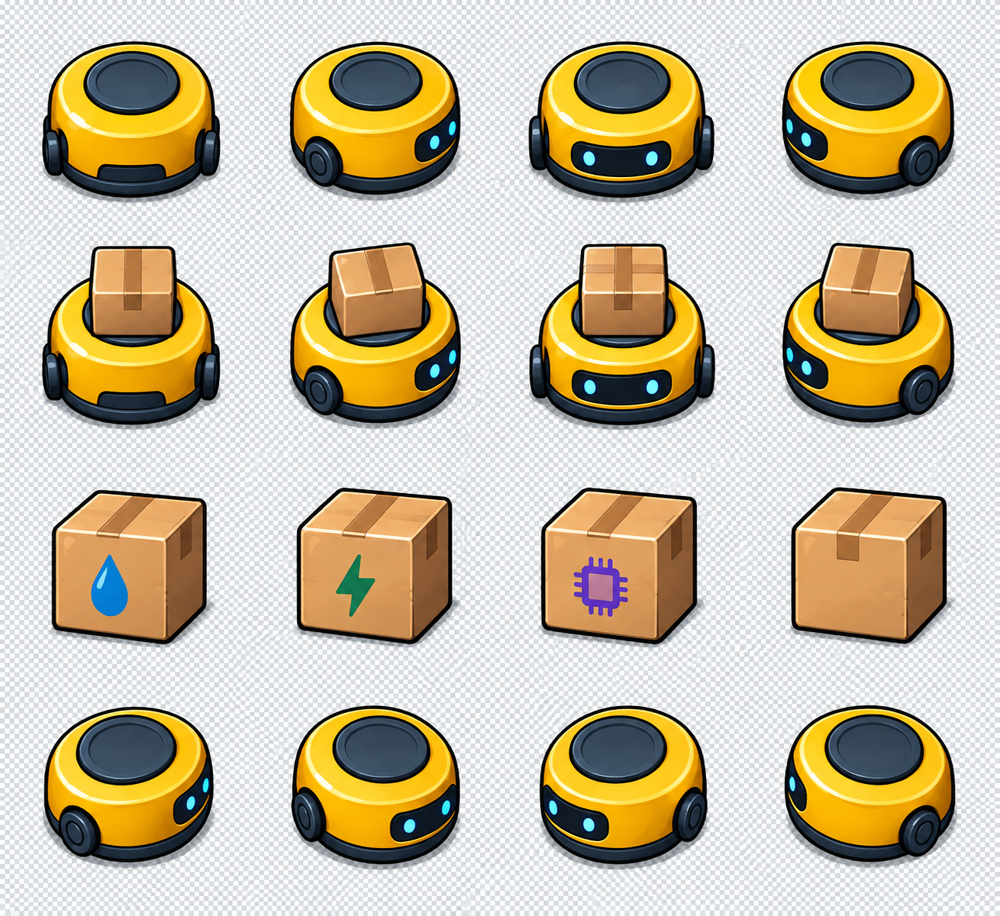
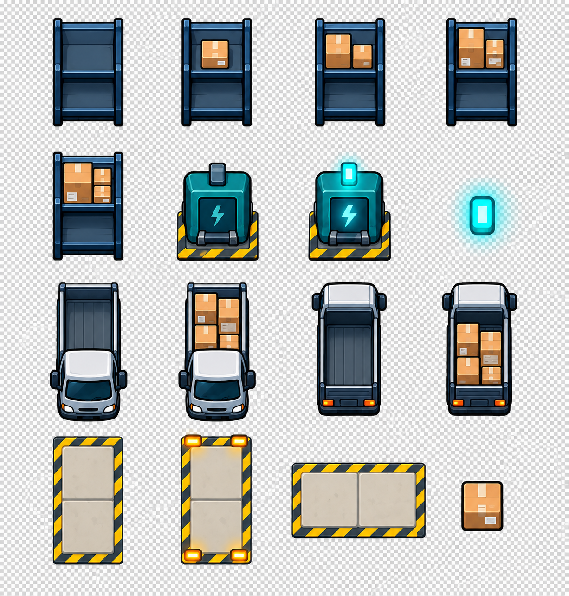
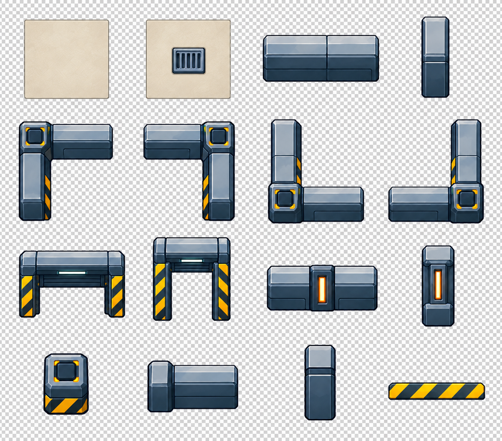

# 完整场景素材图集 v3

按用户要求以 warehouse-concept-v3.png 为主要风格参考；不再使用 v4 的写实方向。采用黄色圆形机器人、深蓝金属货架、青绿充电桩、清晰轮廓和简化材质。货车与装卸口统一为 1×2 格。

本批包含三张 4×4 图集，共 48 个素材槽位，由内置 image_gen 生成。是完整类别的素材设计稿，尚非可直接导入的透明精灵包。

## A：机器人与货物

按行从左到右：

1. 空载机器人：北、东、南、西。
2. 载货机器人：北、东、南、西。
3. 矿泉水箱、电池箱、芯片箱、普通箱。
4. 对角转向姿态：东北、东南、西南、西北（生成方向有偏差，不能作为已验收朝向帧）。

## B：仓储与物流

1. 货架库存状态：0、1、2、3 箱。
2. 4 箱货架、待机充电桩、工作充电桩、充电灯。
3. 南向空车、南向满车、北向空车、北向满车。
4. 纵向 1×2 空装卸位、占用指示装卸位、横向装卸位、纸箱覆盖层。

货车货箱只是满载符号，不定义订单容量。横向装卸位为美术预备素材，不代表旋转玩法已确定。

## C：墙体与地面

1. 普通地砖、排水地砖、横墙、竖墙。
2. 西北、东北、西南、东南墙角。
3. 横向门洞、纵向门洞意图、横向灯墙、竖向灯墙。
4. 立柱、横墙端头、竖墙端头、警示条。

## 检查结果与生产限制

- 三张均为 RGB 文件，棋盘格被画入背景。已尝试通过 image_gen 去除 A 图背景，结果仍为 RGB；失败版本未替换原稿。不得标为透明 PNG。
- A 图背向对角姿态未准确区分，空载与载货帧锚点、箱子比例需校准。
- B 图货架视觉高度较大，物理占地仍为一格，切片时须明确地面锚点，必要时压缩造型；部分箱子数量表达不够清晰。
- C 图纵向门洞仍近似正面门洞，须重制；墙体长度、厚度与接点需要实际拼接验收，地砖有边缘，尚未通过无缝平铺验证。
- 本批尚未切片、统一尺寸或打包引擎坐标表；不宣称已完成生产验收。
- 后续生产应逐项修正透明背景、朝向和几何，再做切片、网格合成与拼接测试。

提示词：atlas-v3-A.prompt.txt、atlas-v3-B.prompt.txt、atlas-v3-C.prompt.txt。早期概念图及其提示词作为历史记录保留，其中 3×2 或 2×3 尺寸已由当前 1×2 规则替代。
