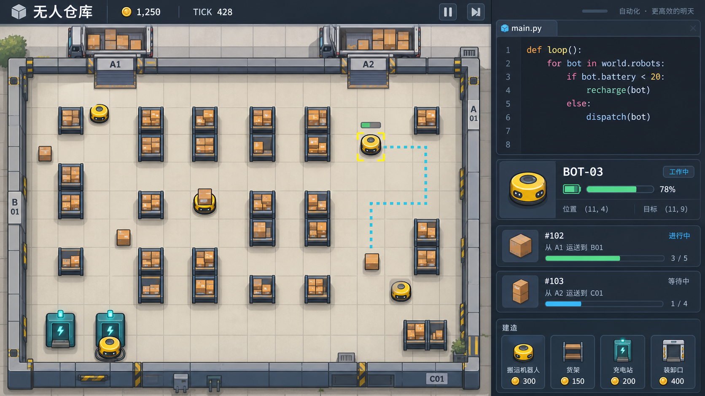

# 美术探索：温暖工业风 v1

状态：供讨论的美术概念，尚未确定为最终风格。

## 方向

- 正交俯视 2D，轻微立体厚度、干净轮廓与柔和阴影，非像素画。
- 米灰地面、石墨蓝界面、黄色机器人、青绿色充电设备和纸箱棕色。
- 圆润小型搬运机器人，与规整工业建筑形成视觉区分。
- 仓库为主视区，侧边显示代码、选中对象和订单；网格、路径、选中框辅助调试。

## 使用边界

本图用于评估配色、造型和界面氛围，不作为精确的空间或交互规范。图中部分货架的单格占位表达、充电机器人的相邻关系仍需在正式资产中修正。图中文字、订单卡片、价格、坐标和代码均为示意，玩法以设计文档为准。

生成方式：内置 image_gen。完整生成提示词见 [warehouse-concept-v1.prompt.txt](warehouse-concept-v1.prompt.txt)。
